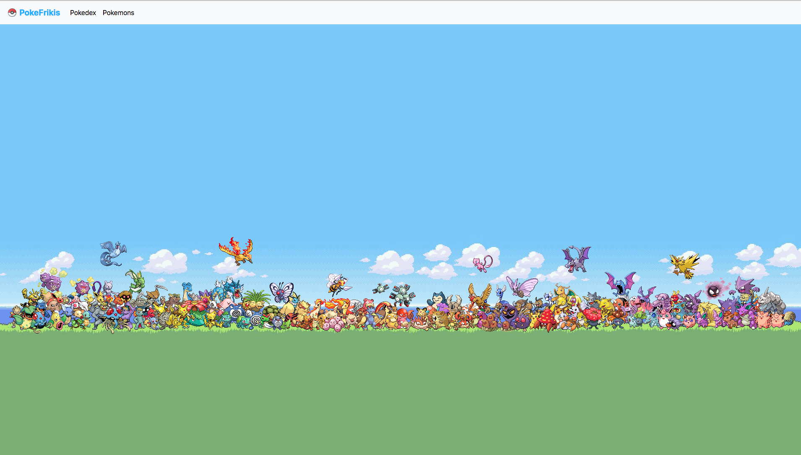

# Pokemon

Pokemon web app developed in Angular and where we use the [PokeApi](https://pokeapi.co/) to get the data.

## Development server

Run `ng serve` for a dev server. Navigate to `http://localhost:4200/`. The app will automatically reload if you change any of the source files.

## Build

Run `ng build` to build the project. The build artifacts will be stored in the `dist/` directory. Use the `--prod` flag for a production build.

## Design

### Home

### Pokedex List

### Pokedex

### Pokemons

